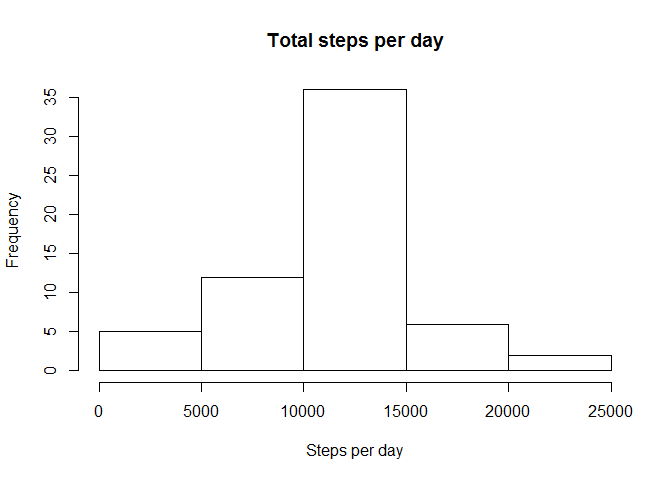

# Reproducible Research: Peer Assessment 1


## Loading and preprocessing the data

```r
mydata <- read.csv(unzip("activity.zip"))
```


## What is mean total number of steps taken per day?

```r
mygraph.data <- aggregate(steps ~ date, mydata, sum)
hist(mygraph.data$steps)
```


```r
#calculate mean
mean(mygraph.data$steps)
```

```
## [1] 10766.19
```

```r
#calculate median
median(mygraph.data$steps)
```

```
## [1] 10765
```


## What is the average daily activity pattern?

```r
mygraph.data <- aggregate(steps ~ interval, mydata, mean)
plot(mygraph.data$interval, mygraph.data$steps, type = "l")
```


```r
#pick interval with most steps
mygraph.data[which.max(mygraph.data$steps),]
```

```
##     interval    steps
## 104      835 206.1698
```


## Imputing missing values

```r
#1. calculate number of missing values
sum(is.na(mydata$steps))
```

```
## [1] 2304
```

```r
#2,3. to fill in missing values, i'll use the mean for each interval across all days
#   which is already in mygraph.data, then use that value to fill in the missing data
mydata.filled <- mydata
mydata.filled$steps[is.na(mydata.filled$steps)] <- mygraph.data$steps[match(mydata.filled$interval, mygraph.data$interval)][which(is.na(mydata.filled$steps))]
#4. histogram
mygraph.data <- aggregate(steps ~ date, mydata.filled, sum)
hist(mygraph.data$steps)
```



```r
#calculate mean
mean(mygraph.data$steps)
```

```
## [1] 10766.19
```

```r
#calculate median
median(mygraph.data$steps)
```

```
## [1] 10766.19
```


## Are there differences in activity patterns between weekdays and weekends?
